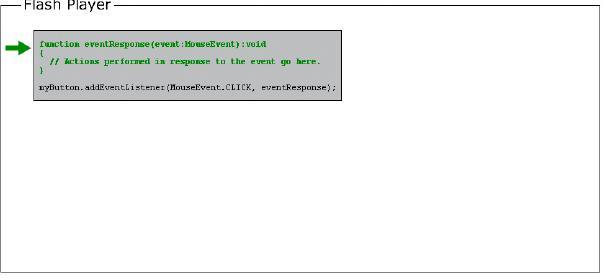
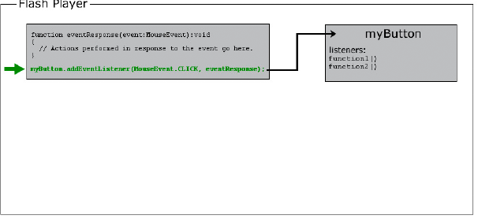
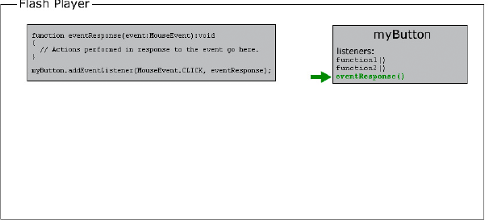
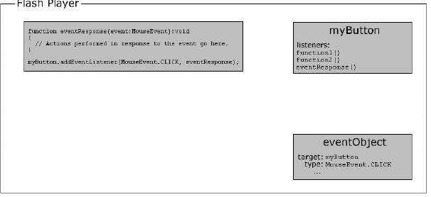
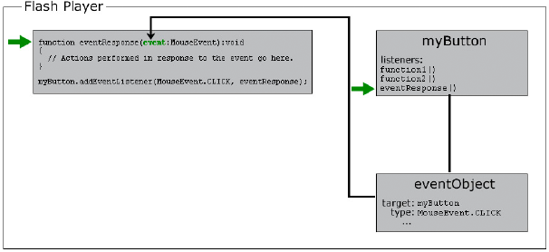
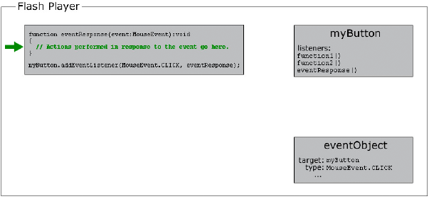

# Working with objects

ActionScript is what’s known as an object-oriented programming language.
Object-oriented programming is simply an approach to programming. It’s really
nothing more than a way to organize the code in a program, using objects.

Earlier the term “computer program” was defined as a series of steps or
instructions that the computer performs. Conceptually, then, you can imagine a
computer program as just a single long list of instructions. However, in
object-oriented programming, the program instructions are divided among
different objects. The code is grouped into chunks of functionality, so related
types of functionality or related pieces of information are grouped in one
container.

#### Adobe Flash Professional

If you’ve worked with symbols in Flash Professional, you’re already used to
working with objects. Imagine you’ve defined a movie clip symbol such as a
drawing of a rectangle and you’ve placed a copy of it on the Stage. That movie
clip symbol is also (literally) an object in ActionScript; it’s an instance of
the MovieClip class.

There are various characteristics of the movie clip that you can modify. When
it’s selected you can change values in the Property inspector like its x
coordinate or its width. You can also make various color adjustments like
changing its alpha (transparency) or applying a drop-shadow filter to it. Other
Flash Professional tools let you make more changes, like using the Free
Transform tool to rotate the rectangle. All of these ways that you can modify a
movie clip symbol in Flash Professional are also available in ActionScript. You
modify the movie clip in ActionScript by changing the pieces of data that are
all put together into a single bundle called a MovieClip object.

In ActionScript object-oriented programming, there are three types of
characteristics that any class can include:

- Properties

- Methods

- Events

These elements are used to manage the pieces of data used by the program and to
decide what actions are carried out and in what order.

## Properties

A property represents one of the pieces of data that are bundled together in an
object. An example song object can have properties named `artist` and `title`;
the MovieClip class has properties like `rotation`, `x`, `width`, and `alpha`.
You work with properties like individual variables. In fact, you can think of
properties as simply the “child” variables contained in an object.

Here are some examples of ActionScript code that uses properties. This line of
code moves the MovieClip named `square` to the x coordinate 100 pixels:

    square.x = 100;

This code uses the rotation property to make the `square` MovieClip rotate to
match the rotation of the `triangle` MovieClip:

    square.rotation = triangle.rotation;

This code alters the horizontal scale of the `square` MovieClip making it
one-and-a-half times wider than it used to be:

    square.scaleX = 1.5;

Notice the common structure: you use a variable (`square`, `triangle`) as the
name of the object, followed by a period (`.`) and then the name of the property
(`x`, `rotation`, `scaleX`). The period, known as the _dot operator_, is used to
indicate that you’re accessing one of the child elements of an object. The whole
structure together, “variable name-dot-property name,” is used like a single
variable, as a name for a single value in the computer’s memory.

## Methods

A _method_ is an action that an object can perform. For example, suppose you’ve
made a movie clip symbol in Flash Professional with several keyframes and
animation on its timeline. That movie clip can play, or stop, or be instructed
to move the playhead to a particular frame.

This code instructs the MovieClip named `shortFilm` to start playing:

    shortFilm.play();

This line makes the MovieClip named `shortFilm` stop playing (the playhead stops
in place, like pausing a video):

    shortFilm.stop();

This code makes a MovieClip named `shortFilm` move its playhead to Frame 1 and
stop playing (like rewinding a video):

    shortFilm.gotoAndStop(1);

Methods, like properties, are accessed by writing the object’s name (a
variable), then a period, and then the name of the method followed by
parentheses. The parentheses are the way that you indicate that you are
_calling_ the method, or in other words, instructing the object to perform that
action. Sometimes values (or variables) are placed in the parentheses, as a way
to pass along additional information that is necessary to carry out the action.
These values are known as method _parameters_. For example, the `gotoAndStop()`
method needs information about which frame to go to, so it requires a single
parameter in the parentheses. Other methods, like `play()` and `stop()`, are
self-explanatory, so they don’t require extra information. Nevertheless, they
are still written with parentheses.

Unlike properties (and variables), methods aren’t used as value placeholders.
However, some methods can perform calculations and return a result that can be
used like a variable. For example, the Number class’s `toString()` method
converts the numeric value to its text representation:

    var numericData:Number = 9;
    var textData:String = numericData.toString();

For example, you would use the `toString()` method if you wanted to display the
value of a Number variable in a text field on the screen. The TextField class’s
`text` property is defined as a String, so it can contain only text values. (The
text `property` represents the actual text content displayed on the screen).
This line of code converts the numeric value in the variable `numericData` to
text. It then makes the value show up on the screen in the TextField object
named `calculatorDisplay`:

    calculatorDisplay.text = numericData.toString();

## Events

A computer program is a series of instructions that the computer carries out
step-by-step. Some simple computer programs consist of nothing more than a few
steps that the computer performs, at which point the program ends. However,
ActionScript programs are designed to keep running, waiting for user input or
other things to happen. Events are the mechanism that determines which
instructions the computer carries out and when.

In essence, _events_ are things that happen that ActionScript is aware of and
can respond to. Many events are related to user interaction, such as a user
clicking a button or pressing a key on the keyboard. There are also other types
of events. For example, if you use ActionScript to load an external image, there
is an event that can let you know when the image has finished loading. When an
ActionScript program is running, conceptually it just sits and waits for certain
things to happen. When those things happen, the specific ActionScript code that
you’ve specified for those events runs.

### Basic event handling

The technique for specifying certain actions to perform in response to
particular events is known as _event handling_. When you are writing
ActionScript code to perform event handling, there are three important elements
you’ll want to identify:

- The event source: Which object is the one the event is going to happen to? For
  example, which button was clicked, or which Loader object is loading the
  image? The event source is also known as the _event target_. It has this name
  because it’s the object where the computer targets the event (that is, where
  the event actually happens).

- The event: What is the thing that is going to happen, the thing that you want
  to respond to? The specific event is important to identify, because many
  objects trigger several events.

- The response: What steps do you want performed when the event happens?

Any time you write ActionScript code to handle events, it requires these three
elements. The code follows this basic structure (elements in bold are
placeholders you’d fill in for your specific case):

    function eventResponse(eventObject:EventType):void
    {
        // Actions performed in response to the event go here.
    }

    eventSource.addEventListener(EventType.EVENT_NAME, eventResponse);

This code does two things. First, it defines a function, which is the way to
specify the actions you want performed in response to the event. Next, it calls
the `addEventListener()` method of the source object. Calling
`addEventListener()` essentially “subscribes” the function to the specified
event. When the event happens, the function’s actions are carried out. Consider
each of these parts in more detail.

A _function_ provides a way for you to group actions with a single name that is
like a shortcut name to carry out the actions. A function is identical to a
method except that it isn’t necessarily associated with a specific class. (In
fact, the term “method” could be defined as a function that is associated with a
particular class.) When you're creating a function for event handling, you
choose the name for the function (named `eventResponse` in this case). You also
specify one parameter (named `eventObject` in this example). Specifying a
function parameter is like declaring a variable, so you also have to indicate
the data type of the parameter. (In this example, the parameter's data type is
`EventType`.)

Each type of event that you want to listen to has an ActionScript class
associated with it. The data type you specify for the function parameter is
always the associated class of the specific event you want to respond to. For
example, a `click` event (triggered when the user clicks an item with the mouse)
is associated with the MouseEvent class. To write a listener function for a
`click` event, you define the listener function with a parameter with the data
type MouseEvent. Finally, between the opening and closing curly brackets (`{`...
`}`), you write the instructions you want the computer to carry out when the
event happens.

The event-handling function is written. Next you tell the event source object
(the object that the event happens to, for example the button) that you want it
to call your function when the event happens. You register your function with
the event source object by calling the `addEventListener()` method of that
object (all objects that have events also have an `addEventListener()` method).
The `addEventListener()` method takes two parameters:

- First, the name of the specific event you want to respond to. Each event is
  affiliated with a specific class. Every event class has a special value, which
  is like a unique name, defined for each of its events. You use that value for
  the first parameter.

- Second, the name of your event response function. Note that a function name is
  written without parentheses when it’s passed as a parameter.

### The event-handling process

The following is a step-by-step description of the process that happens when you
create an event listener. In this case, it’s an example of creating a listener
function that is called when an object named `myButton` is clicked.

The actual code written by the programmer is as follows:

    function eventResponse(event:MouseEvent):void
    {
        // Actions performed in response to the event go here.
    }

    myButton.addEventListener(MouseEvent.CLICK, eventResponse);

Here is how this code would actually work when it’s running:

1.  When the SWF file loads, the computer makes note of the fact that there’s a
    function named `eventResponse()`.

    

2.  The computer then runs the code (specifically, the lines of code that aren’t
    in a function). In this case that’s only one line of code: calling the
    `addEventListener()` method on the event source object (named `myButton`)
    and passing the `eventResponse` function as a parameter.

    

    Internally, `myButton` keeps a list of functions that are listening to each
    of its events. When its `addEventListener()` method is called, `myButton`
    stores the `eventResponse()` function in its list of event listeners.

    

3.  At some point, the user clicks the `myButton` object, triggering its `click`
    event (identified as `MouseEvent.CLICK` in the code).

    

    At that point, the following occurs:

    1.  An object is created that’s an instance of the class associated with the
        event in question (MouseEvent in this example). For many events, this
        object is an instance of the Event class. For mouse events, it is a
        MouseEvent instance. For other events, it is an instance of the class
        that’s associated with that event. This object that’s created is known
        as the _event object_, and it contains specific information about the
        event that happened: what type of event it is, where it happened, and
        other event-specific information if applicable.

        

    2.  The computer then looks at the list of event listeners stored by
        `myButton`. It goes through these functions one by one, calling each
        function and passing the event object to the function as a parameter.
        Since the `eventResponse()` function is one of `myButton`’s listeners,
        as part of this process the computer calls the `eventResponse()`
        function.

        

    3.  When the `eventResponse()` function is called, the code in that function
        runs, so your specified actions are carried out.

        

### Event-handling examples

Here are a few more concrete examples of event handling code. These examples are
meant to give you an idea of some of the common event elements and possible
variations available when you write event-handling code:

- Clicking a button to start the current movie clip playing. In the following
  example, `playButton` is the instance name of the button, and `this` is a
  special name meaning “the current object”:

      this.stop();

      function playMovie(event:MouseEvent):void
      {
          this.play();
      }

      playButton.addEventListener(MouseEvent.CLICK, playMovie);

- Detecting typing in a text field. In this example, `entryText` is an input
  text field, and `outputText` is a dynamic text field:

      function updateOutput(event:TextEvent):void
      {
          var pressedKey:String = event.text;
          outputText.text = "You typed: " + pressedKey;
      }

      entryText.addEventListener(TextEvent.TEXT_INPUT, updateOutput);

- Clicking a button to navigate to a URL. In this case, `linkButton` is the
  instance name of the button:

      function gotoAdobeSite(event:MouseEvent):void
      {
          var adobeURL:URLRequest = new URLRequest("http://www.adobe.com/");
          navigateToURL(adobeURL);
      }

      linkButton.addEventListener(MouseEvent.CLICK, gotoAdobeSite);

## Creating object instances

Before you can use an object in ActionScript, the object has to exist in the
first place. One part of creating an object is declaring a variable; however,
declaring a variable only creates an empty place in the computer’s memory.
Always assign an actual value to the variable (create an object and store it in
the variable) before you attempt to use or manipulate it. The process of
creating an object is known as _instantiating_ the object. In other words, you
create an instance of a particular class.

One simple way to create an object instance doesn’t involve ActionScript at all.
In Flash Professional place a movie clip symbol, button symbol, or text field on
the Stage and assign it an instance name. Flash Professional automatically
declares a variable with that instance name, creates an object instance, and
stores that object in the variable. Similarly, in Flex you create a component in
MXML either by coding an MXML tag or by placing the component on the editor in
Flash Builder Design mode. When you assign an ID to that component, that ID
becomes the name of an ActionScript variable containing that component instance.

However, you don’t always want to create an object visually, and for non-visual
objects you can’t. There are several additional ways you can create object
instances using only ActionScript.

With several ActionScript data types, you can create an instance using a
_literal expression_, which is a value written directly into the ActionScript
code. Here are some examples:

- Literal numeric value (enter the number directly):

      var someNumber:Number = 17.239;
      var someNegativeInteger:int = -53;
      var someUint:uint = 22;

- Literal String value (surround the text with double quotation marks):

      var firstName:String = "George";
      var soliloquy:String = "To be or not to be, that is the question...";

- Literal Boolean value (use the literal values `true` or `false`):

      var niceWeather:Boolean = true;
      var playingOutside:Boolean = false;

- Literal Array value (wrap a comma-separated list of values in square
  brackets):

      var seasons:Array = ["spring", "summer", "autumn", "winter"];

- Literal XML value (enter the XML directly):

      var employee:XML = <employee>
              <firstName>Harold</firstName>
              <lastName>Webster</lastName>
          </employee>;

ActionScript also defines literal expressions for the Array, RegExp, Object, and
Function data types.

The most common way to create an instance for any data type is to use the `new`
operator with the class name, as shown here:

    var raceCar:MovieClip = new MovieClip();
    var birthday:Date = new Date(2006, 7, 9);

Creating an object using the `new` operator is often described as “calling the
class’s constructor.” A _constructor_ is a special method that is called as part
of the process of creating an instance of a class. Notice that when you create
an instance in this way, you put parentheses after the class name. Sometimes you
specify parameter values in the parentheses. These are two things that you also
do when calling a method.

Even for those data types that let you create instances using a literal
expression, you can also use the `new` operator to create an object instance.
For example, these two lines of code do the same thing:

    var someNumber:Number = 6.33;
    var someNumber:Number = new Number(6.33);

It’s important to be familiar with the `new`_ClassName_`()` way of creating
objects. Many ActionScript data types don’t have a visual representation.
Consequently, they can’t be created by placing an item on the Flash Professional
Stage or the Design mode of Flash Builder’s MXML editor. You can only create an
instance of any of those data types in ActionScript using the `new` operator.

#### Adobe Flash Professional

In Flash Professional, the `new` operator can also be used to create an instance
of a movie clip symbol that is defined in the Library but isn’t placed on the
Stage.

More Help topics

 
[Working with arrays](https://web.archive.org/web/20120103090117mp_/http://help.adobe.com/en_US/as3/dev/WS5b3ccc516d4fbf351e63e3d118a9b90204-7fdc.html)

 
[Using regular expressions](https://web.archive.org/web/20120103090117mp_/http://help.adobe.com/en_US/as3/dev/WS5b3ccc516d4fbf351e63e3d118a9b90204-7fdb.html)

 
[Creating MovieClip objects with ActionScript](https://web.archive.org/web/20120103090117mp_/http://help.adobe.com/en_US/as3/dev/WS5b3ccc516d4fbf351e63e3d118a9b90204-7fd2.html)
