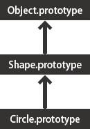
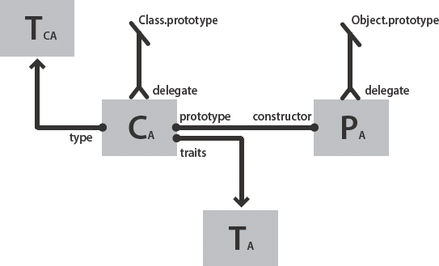

# Advanced topics

## History of ActionScript OOP support

Because ActionScript 3.0 builds upon previous versions of ActionScript, it may
be helpful to understand how the ActionScript object model has evolved.
ActionScript began as a simple scripting mechanism for early versions of Flash
Professional. Later, programmers began building increasingly complex
applications with ActionScript. In response to the needs of such programmers,
each subsequent release has added language features that facilitate the creation
of complex applications.

#### ActionScript 1.0

ActionScript 1.0 is the version of the language used in Flash Player 6 and
earlier. Even at this early stage of development, the ActionScript object model
was based on the concept of the object as a fundamental data type. An
ActionScript object is a compound data type with a group of _properties_. When
discussing the object model, the term _properties_ includes everything that is
attached to an object, such as variables, functions, or methods.

Although this first generation of ActionScript does not support the definition
of classes with a `class` keyword, you can define a class using a special kind
of object called a prototype object. Instead of using a `class` keyword to
create an abstract class definition that you instantiate into concrete objects,
as you do in class-based languages like Java and C++, prototype-based languages
like ActionScript 1.0 use an existing object as a model (or prototype) for other
objects. While objects in a class-based language may point to a class that
serves as its template, objects in a prototype-based language point instead to
another object, its prototype, that serves as its template.

To create a class in ActionScript 1.0, you define a constructor function for
that class. In ActionScript, functions are actual objects, not just abstract
definitions. The constructor function that you create serves as the prototypical
object for instances of that class. The following code creates a class named
Shape and defines one property named `visible` that is set to `true` by default:

    // base class
    function Shape() {}
    // Create a property named visible.
    Shape.prototype.visible = true;

This constructor function defines a Shape class that you can instantiate with
the `new` operator, as follows:

    myShape = new Shape();

Just as the `Shape()` constructor function object serves as the prototype for
instances of the Shape class, it can also serve as the prototype for subclasses
of Shape—that is, other classes that extend the Shape class.

The creation of a class that is a subclass of the Shape class is a two-step
process. First, create the class by defining a constructor function for the
class, as follows:

    // child class
    function Circle(id, radius)
    {
        this.id = id;
        this.radius = radius;
    }

Second, use the `new` operator to declare that the Shape class is the prototype
for the Circle class. By default, any class you create uses the Object class as
its prototype, which means that `Circle.prototype` currently contains a generic
object (an instance of the Object class). To specify that Circle’s prototype is
Shape instead of Object, use the following code to change the value of
`Circle.prototype` so that it contains a Shape object instead of a generic
object:

    // Make Circle a subclass of Shape.
    Circle.prototype = new Shape();

The Shape class and the Circle class are now linked together in an inheritance
relationship that is commonly known as the _prototype chain_. The diagram
illustrates the relationships in a prototype chain:

The base class at the end of every prototype chain is the Object class. The
Object class contains a static property named `Object.prototype` that points to
the base prototype object for all objects created in ActionScript 1.0. The next
object in the example prototype chain is the Shape object. This is because the
`Shape.prototype` property was never explicitly set, so it still holds a generic
object (an instance of the Object class). The final link in this chain is the
Circle class, which is linked to its prototype, the Shape class (the
`Circle.prototype` property holds a Shape object).

If you create an instance of the Circle class, as in the following example, the
instance inherits the prototype chain of the Circle class:

    // Create an instance of the Circle class.
    myCircle = new Circle();

Recall that the example included a property named `visible` as a member of the
Shape class. In this example, the `visible` property does not exist as a part of
the `myCircle` object, only as a member of the Shape object, yet the following
line of code outputs `true`:

    trace(myCircle.visible); // output: true

The runtime is able to ascertain that the `myCircle` object inherits the
`visible` property by walking up the prototype chain. When executing this code,
the runtime first searches through the properties of the `myCircle` object for a
property named `visible`, but does not find such a property. It looks next in
the `Circle.prototype` object, but still does not find a property named
`visible`. Continuing up the prototype chain, it finally finds the `visible`
property defined on the `Shape.prototype` object and outputs the value of that
property.

In the interest of simplicity, many of the details and intricacies of the
prototype chain are omitted. Instead the goal is to provide enough information
to help you understand the ActionScript 3.0 object model.

#### ActionScript 2.0

ActionScript 2.0 introduced new keywords such as `class`, `extends`, `public`,
and `private`, that allowed you to define classes in a way that is familiar to
anyone who works with class-based languages like Java and C++. It’s important to
understand that the underlying inheritance mechanism did not change between
ActionScript 1.0 and ActionScript 2.0. ActionScript 2.0 merely added a new
syntax for defining classes. The prototype chain works the same way in both
versions of the language.

The new syntax introduced by ActionScript 2.0, shown in the following excerpt,
allows you to define classes in a way that many programmers find more intuitive:

    // base class
    class Shape
    {
        var visible:Boolean = true;
    }

Note that ActionScript 2.0 also introduced type annotations for use with
compile-time type checking. This allows you to declare that the `visible`
property in the previous example should contain only a Boolean value. The new
`extends` keyword also simplifies the process of creating a subclass. In the
following example, the two-step process necessary in ActionScript 1.0 is
accomplished in one step with the `extends` keyword:

    // child class
    class Circle extends Shape
    {
        var id:Number;
        var radius:Number;
        function Circle(id, radius)
        {
            this.id = id;
            this.radius = radius;
            }
    }

The constructor is now declared as part of the class definition, and the class
properties `id` and `radius` must also be declared explicitly.

ActionScript 2.0 also added support for the definition of interfaces, which
allow you to further refine your object-oriented programs with formally defined
protocols for inter-object communication.

## The ActionScript 3.0 class object

A common object-oriented programming paradigm, most commonly associated with
Java and C++, uses classes to define types of objects. Programming languages
that adopt this paradigm also tend to use classes to construct instances of the
data type that the class defines. ActionScript uses classes for both of these
purposes, but its roots as a prototype-based language add an interesting
characteristic. ActionScript creates for each class definition a special class
object that allows sharing of both behavior and state. For many ActionScript
programmers, however, this distinction may have no practical coding
implications. ActionScript 3.0 is designed such that you can create
sophisticated object-oriented ActionScript applications without using, or even
understanding, these special class objects.

The following diagram shows the structure of a class object that represents a
simple class named A that is defined with the statement `class A {}`:

Each rectangle in the diagram represents an object. Each object in the diagram
has a subscript character A to represent that it belongs to class A. The class
object (CA) contains references to a number of other important objects. An
instance traits object (TA) stores the instance properties that are defined
within a class definition. A class traits object (TCA) represents the internal
type of the class and stores the static properties defined by the class (the
subscript character C stands for “class”). The prototype object (PA) always
means the class object to which it was originally attached through the
`constructor` property.

## The traits object

The traits object, which is new in ActionScript 3.0, was implemented with
performance in mind. In previous versions of ActionScript, name lookup could be
a time-consuming process as Flash Player walked the prototype chain. In
ActionScript 3.0, name lookup is much more efficient and less time consuming,
because inherited properties are copied down from superclasses into the traits
object of subclasses.

The traits object is not directly accessible to programmer code, but its
presence can be felt by the improvements in performance and memory usage. The
traits object provides the AVM2 with detailed information about the layout and
contents of a class. With such knowledge, the AVM2 is able to significantly
reduce execution time, because it can often generate direct machine instructions
to access properties or call methods directly without a time-consuming name
lookup.

Thanks to the traits object, an object’s memory footprint can be significantly
smaller than a similar object in previous versions of ActionScript. For example,
if a class is sealed (that is, the class is not declared dynamic), an instance
of the class does not need a hash table for dynamically added properties, and
can hold little more than a pointer to the traits objects and some slots for the
fixed properties defined in the class. As a result, an object that required 100
bytes of memory in ActionScript 2.0 could require as little as 20 bytes of
memory in ActionScript 3.0.

Note: The traits object is an internal implementation detail, and there is no
guarantee that it will not change or even disappear in future versions of
ActionScript.

## The prototype object

Every ActionScript class object has a property named `prototype`, which is a
reference to the class’s prototype object. The prototype object is a legacy of
ActionScript’s roots as prototype-based language. For more information, see
History of ActionScript OOP support.

The `prototype`property is read-only, which means that it cannot be modified to
point to different objects. This differs from the class `prototype` property in
previous versions of ActionScript, where the prototype could be reassigned so
that it pointed to a different class. Although the `prototype` property is
read-only, the prototype object that it references is not. In other words, new
properties can be added to the prototype object. Properties added to the
prototype object are shared among all instances of the class.

The prototype chain, which was the only inheritance mechanism in previous
versions of ActionScript, serves only a secondary role in ActionScript 3.0. The
primary inheritance mechanism, fixed property inheritance, is handled internally
by the traits object. A fixed property is a variable or method that is defined
as part of a class definition. Fixed property inheritance is also called class
inheritance, because it is the inheritance mechanism that is associated with
keywords such as `class`, `extends`, and `override`.

The prototype chain provides an alternative inheritance mechanism that is more
dynamic than fixed property inheritance. You can add properties to a class’s
prototype object not only as part of the class definition, but also at run time
through the class object’s `prototype` property. Note, however, that if you set
the compiler to strict mode, you may not be able to access properties added to a
prototype object unless you declare a class with the `dynamic` keyword.

A good example of a class with several properties attached to the prototype
object is the Object class. The Object class’s `toString()` and `valueOf()`
methods are actually functions assigned to properties of the Object class’s
prototype object. The following is an example of how the declaration of these
methods could, in theory, look (the actual implementation differs slightly
because of implementation details):

    public dynamic class Object
    {
        prototype.toString = function()
        {
            // statements
        };
        prototype.valueOf = function()
        {
            // statements
        };
    }

As mentioned previously, you can attach a property to a class’s prototype object
outside the class definition. For example, the `toString()` method can also be
defined outside the Object class definition, as follows:

    Object.prototype.toString = function()
    {
        // statements
    };

Unlike fixed property inheritance, however, prototype inheritance does not
require the `override` keyword if you want to redefine a method in a subclass.
For example. if you want to redefine the `valueOf()` method in a subclass of the
Object class, you have three options. First, you can define a `valueOf()` method
on the subclass’s prototype object inside the class definition. The following
code creates a subclass of Object named Foo and redefines the `valueOf()` method
on Foo’s prototype object as part of the class definition. Because every class
inherits from Object, it is not necessary to use the `extends` keyword.

    dynamic class Foo
    {
        prototype.valueOf = function()
        {
            return "Instance of Foo";
        };
    }

Second, you can define a `valueOf()` method on Foo’s prototype object outside
the class definition, as shown in the following code:

    Foo.prototype.valueOf = function()
    {
        return "Instance of Foo";
    };

Third, you can define a fixed property named `valueOf()` as part of the Foo
class. This technique differs from the others in that it mixes fixed property
inheritance with prototype inheritance. Any subclass of Foo that wants to
redefine `valueOf()` must use the `override` keyword. The following code shows
`valueOf()` defined as a fixed property in Foo:

    class Foo
    {
        function valueOf():String
        {
            return "Instance of Foo";
        }
    }

## The AS3 namespace

The existence of two separate inheritance mechanisms, fixed property inheritance
and prototype inheritance, creates an interesting compatibility challenge with
respect to the properties and methods of the core classes. Compatibility with
the ECMAScript language specification on which ActionScript is based requires
the use of prototype inheritance, which means that the properties and methods of
a core class are defined on the prototype object of that class. On the other
hand, compatibility with ActionScript 3.0 calls for the use of fixed property
inheritance, which means that the properties and methods of a core class are
defined in the class definition using the `const`, `var`, and `function`
keywords. Moreover, the use of fixed properties instead of the prototype
versions can lead to significant increases in run-time performance.

ActionScript 3.0 solves this problem by using both prototype inheritance and
fixed property inheritance for the core classes. Each core class contains two
sets of properties and methods. One set is defined on the prototype object for
compatibility with the ECMAScript specification, and the other set is defined
with fixed properties and the AS3 namespace for compatibility with ActionScript
3.0.

The AS3 namespace provides a convenient mechanism for choosing between the two
sets of properties and methods. If you do not use the AS3 namespace, an instance
of a core class inherits the properties and methods defined on the core class’s
prototype object. If you decide to use the AS3 namespace, an instance of a core
class inherits the AS3 versions because fixed properties are always preferred
over prototype properties. In other words, whenever a fixed property is
available, it is always used instead of an identically named prototype property.

You can selectively use the AS3 namespace version of a property or method by
qualifying it with the AS3 namespace. For example, the following code uses the
AS3 version of the `Array.pop()` method:

    var nums:Array = new Array(1, 2, 3);
    nums.AS3::pop();
    trace(nums); // output: 1,2

Alternatively, you can use the `use namespace` directive to open the AS3
namespace for all the definitions within a block of code. For example, the
following code uses the `use namespace` directive to open the AS3 namespace for
both the `pop()` and `push()` methods:

    use namespace AS3;

    var nums:Array = new Array(1, 2, 3);
    nums.pop();
    nums.push(5);
    trace(nums) // output: 1,2,5

ActionScript 3.0 also provides compiler options for each set of properties so
that you can apply the AS3 namespace to your entire program. The `-as3` compiler
option represents the AS3 namespace, and the `-es` compiler option represents
the prototype inheritance option (`es` stands for ECMAScript). To open the AS3
namespace for your entire program, set the `-as3` compiler option to `true` and
the `-es` compiler option to `false`. To use the prototype versions, set the
compiler options to the opposite values. The default compiler settings for Flash
Builder and Flash Professional are `-as3 = true` and `-es = false`.

If you plan to extend any of the core classes and override any methods, you
should understand how the AS3 namespace can affect how you must declare an
overridden method. If you are using the AS3 namespace, any method override of a
core class method must also use the AS3 namespace along with the `override`
attribute. If you are not using the AS3 namespace and want to redefine a core
class method in a subclass, you should not use the AS3 namespace or the
`override` keyword.
