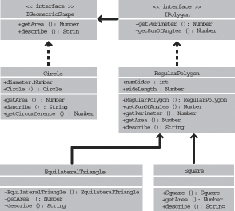

# Example: GeometricShapes

The GeometricShapes sample application shows how a number of object-oriented
concepts and features can be applied using ActionScript 3.0, including:

- Defining classes

- Extending classes

- Polymorphism and the `override` keyword

- Defining, extending, and implementing interfaces

It also includes a “factory method” that creates class instances, showing how to
declare a return value as an instance of an interface, and use that returned
object in a generic way.

To get the application files for this sample, see
[_FlashPlatformAS3DevGuideExamples.zip_](https://github.com/joshtynjala/flash-platform-as3-dev-guide-examples/releases/tag/original).
The GeometricShapes application files can be found in the folder
Samples/GeometricShapes. The application consists of the following files:

<table>
<colgroup>
<col style="width: 50%" />
<col style="width: 50%" />
</colgroup>
<thead>
<tr class="header">
<th>
File
</th>
<th>
Description
</th>
</tr>
</thead>
<tbody>
<tr class="odd">
<td>
GeometricShapes.mxml

or

GeometricShapes.fla
</td>
<td>
The main application file in Flash (FLA) or Flex (MXML).
</td>
</tr>
<tr class="even">
<td>
com/example/programmingas3/geometricshapes/IGeometricShape.as
</td>
<td>
The base interface defining methods to be implemented by all
GeometricShapes application classes.
</td>
</tr>
<tr class="odd">
<td>
com/example/programmingas3/geometricshapes/IPolygon.as
</td>
<td>
An interface defining methods to be implemented by
GeometricShapes application classes that have multiple sides.
</td>
</tr>
<tr class="even">
<td>
com/example/programmingas3/geometricshapes/RegularPolygon.as
</td>
<td>
A type of geometric shape that has sides of equal length
postponed symmetrically around the shape’s center.
</td>
</tr>
<tr class="odd">
<td>
com/example/programmingas3/geometricshapes/Circle.as
</td>
<td>
A type of geometric shape that defines a circle.
</td>
</tr>
<tr class="even">
<td>
com/example/programmingas3/geometricshapes/EquilateralTriangle.as
</td>
<td>
A subclass of RegularPolygon that defines a triangle with all
sides the same length.
</td>
</tr>
<tr class="odd">
<td>
com/example/programmingas3/geometricshapes/Square.as
</td>
<td>
A subclass of RegularPolygon defining a rectangle with all four
sides the same length.
</td>
</tr>
<tr class="even">
<td>
com/example/programmingas3/geometricshapes/GeometricShapeFactory.as
</td>
<td>
A class containing a factory method for creating shapes given a
shape type and size.
</td>
</tr>
</tbody>
</table>

## Defining the GeometricShapes classes

The GeometricShapes application lets the user specify a type of geometric shape
and a size. It then responds with a description of the shape, its area, and
distance around its perimeter.

The application user interface is trivial, including a few controls for
selecting the type of shape, setting the size, and displaying the description.
The most interesting part of this application is under the surface, in the
structure of the classes and interfaces themselves.

This application deals with geometric shapes, but it doesn’t display them
graphically.

The classes and interfaces that define the geometric shapes in this example are
shown in the following diagram using Unified Modeling Language (UML) notation:

GeometricShapes Example Classes

## Defining common behavior with interfaces

This GeometricShapes application deals with three types of shapes: circles,
squares, and equilateral triangles. The GeometricShapes class structure begins
with a very simple interface, IGeometricShape, that lists methods common to all
three types of shapes:

    package com.example.programmingas3.geometricshapes
    {
        public interface IGeometricShape
        {
            function getArea():Number;
            function describe():String;
        }
    }

The interface defines two methods: the `getArea()` method, which calculates and
returns the area of the shape, and the `describe()` method, which assembles a
text description of the shape’s properties.

It’s also desirable to know the distance around the perimeter of each shape.
However, the perimeter of a circle is called the circumference, and it’s
calculated in a unique way, so the behavior diverges from that of a triangle or
a square. Still there is enough similarity between triangles, squares, and other
polygons that it makes sense to define a new interface class just for them:
IPolygon. The IPolygon interface is also rather simple, as shown here:

    package com.example.programmingas3.geometricshapes
    {
        public interface IPolygon extends IGeometricShape
        {
            function getPerimeter():Number;
            function getSumOfAngles():Number;
        }
    }

This interface defines two methods common to all polygons: the `getPerimeter()`
method that measures the combined distance of all the sides, and the
`getSumOfAngles()` method that adds up all the interior angles.

The IPolygon interface extends the IGeometricShape interface, which means that
any class that implements the IPolygon interface must declare all four
methods—the two from the IGeometricShape interface, and the two from the
IPolygon interface.

## Defining the shape classes

Once you have a good idea about the methods common to each type of shape, you
can define the shape classes themselves. In terms of how many methods you need
to implement, the simplest shape is the Circle class, shown here:

    package com.example.programmingas3.geometricshapes
    {
        public class Circle implements IGeometricShape
        {
            public var diameter:Number;

            public function Circle(diam:Number = 100):void
            {
                this.diameter = diam;
            }

            public function getArea():Number
            {
                // The formula is Pi * radius * radius.
                var radius:Number = diameter / 2;
                return Math.PI * radius * radius;
            }

            public function getCircumference():Number
            {
                // The formula is Pi * diameter.
                return Math.PI * diameter;
            }

            public function describe():String
            {
                var desc:String = "This shape is a Circle.\n";
                desc += "Its diameter is " + diameter + " pixels.\n";
                desc += "Its area is " + getArea() + ".\n";
                desc += "Its circumference is " + getCircumference() + ".\n";
                return desc;
            }
        }
    }

The Circle class implements the IGeometricShape interface, so it must provide
code for both the `getArea()` method and the `describe()` method. In addition,
it defines the `getCircumference()` method, which is unique to the Circle class.
The Circle class also declares a property, `diameter`, which won’t be found in
the other polygon classes.

The other two types of shapes, squares and equilateral triangles, have some
other things in common: they each have sides of equal length, and there are
common formulas you can use to calculate the perimeter and sum of interior
angles for both. In fact, those common formulas apply to any other regular
polygons that you define in the future as well.

The RegularPolygon class is the superclass for both the Square class and the
EquilateralTriangle class. A superclass lets you define common methods in one
place, so you don’t have to define them separately in each subclass. Here is the
code for the RegularPolygon class:

    package com.example.programmingas3.geometricshapes
    {
        public class RegularPolygon implements IPolygon
        {
            public var numSides:int;
            public var sideLength:Number;

            public function RegularPolygon(len:Number = 100, sides:int = 3):void
            {
                this.sideLength = len;
                this.numSides = sides;
            }

            public function getArea():Number
            {
                // This method should be overridden in subclasses.
                return 0;
            }

            public function getPerimeter():Number
            {
                return sideLength * numSides;
            }

            public function getSumOfAngles():Number
            {
                if (numSides >= 3)
                {
                    return ((numSides - 2) * 180);
                }
                else
                {
                    return 0;
                }
            }

            public function describe():String
            {
                var desc:String = "Each side is " + sideLength + " pixels long.\n";
                desc += "Its area is " + getArea() + " pixels square.\n";
                desc += "Its perimeter is " + getPerimeter() + " pixels long.\n";
                desc += "The sum of all interior angles in this shape is " + getSumOfAngles() + " degrees.\n";
                return desc;
            }
        }
    }

First, the RegularPolygon class declares two properties that are common to all
regular polygons: the length of each side (the `sideLength` property) and the
number of sides (the `numSides` property).

The RegularPolygon class implements the IPolygon interface and declares all four
of the IPolygon interface methods. It implements two of these—the
`getPerimeter()` and `getSumOfAngles()` methods—using common formulas.

Because the formula for the `getArea()` method differs from shape to shape, the
base class version of the method cannot include common logic that can be
inherited by the subclass methods. Instead, it simply returns a 0 default value
to indicate that the area was not calculated. To calculate the area of each
shape correctly, the subclasses of the RegularPolygon class have to override the
`getArea()` method themselves.

The following code for the EquilateralTriangle class show how the `getArea()`
method is overridden:

    package com.example.programmingas3.geometricshapes
    {
        public class EquilateralTriangle extends RegularPolygon
        {
            public function EquilateralTriangle(len:Number = 100):void
            {
                super(len, 3);
            }

            public override function getArea():Number
            {
                // The formula is ((sideLength squared) * (square root of 3)) / 4.
                return ( (this.sideLength * this.sideLength) * Math.sqrt(3) ) / 4;
            }

            public override function describe():String
            {
                /* starts with the name of the shape, then delegates the rest
                of the description work to the RegularPolygon superclass */
                var desc:String = "This shape is an equilateral Triangle.\n";
                desc += super.describe();
                return desc;
            }
        }
    }

The `override` keyword indicates that the `EquilateralTriangle.getArea()` method
intentionally overrides the `getArea()` method from the RegularPolygon
superclass. When the `EquilateralTriangle.getArea()` method is called, it
calculates the area using the formula in the preceding code, and the code in the
`RegularPolygon.getArea()` method never executes.

In contrast, the EquilateralTriangle class doesn’t define its own version of the
`getPerimeter()` method. When the `EquilateralTriangle.getPerimeter()` method is
called, the call goes up the inheritance chain and executes the code in the
`getPerimeter()` method of the RegularPolygon superclass.

The `EquilateralTriangle()` constructor uses the `super()` statement to
explicitly invoke the `RegularPolygon()` constructor of its superclass. If both
constructors had the same set of parameters, you could have omitted the
`EquilateralTriangle()` constructor completely, and the `RegularPolygon()`
constructor would be executed instead. However, the `RegularPolygon()`
constructor needs an extra parameter, `numSides`. So the `EquilateralTriangle()`
constructor calls `super(len, 3)`, which passes along the `len` input parameter
and the value 3 to indicate that the triangle has three sides.

The `describe()` method also uses the `super()` statement, but in a different
way. It uses it to invoke the RegularPolygon superclass’ version of the
`describe()` method. The `EquilateralTriangle.describe()` method first sets the
`desc` string variable to a statement about the type of shape. Then it gets the
results of the `RegularPolygon.describe()` method by calling `super.describe()`,
and it appends that result to the `desc` string.

The Square class isn’t described in detail here, but it is similar to the
EquilateralTriangle class, providing a constructor and its own implementations
of the `getArea()` and `describe()` methods.

## Polymorphism and the factory method

A set of classes that make good use of interfaces and inheritance can be used in
many interesting ways. For example, all of the shape classes described so far
either implement the IGeometricShape interface or extend a superclass that does.
So if you define a variable to be an instance of IGeometricShape, you don’t have
to know whether it is actually an instance of the Circle or the Square class to
call its `describe()` method.

The following code shows how this works:

    var myShape:IGeometricShape = new Circle(100);
    trace(myShape.describe());

When `myShape.describe()` is called, it executes the method `Circle.describe()`,
because even though the variable is defined as an instance of the
IGeometricShape interface, Circle is its underlying class.

This example shows the principle of polymorphism in action: the exact same
method call results in different code being executed, depending on the class of
the object whose method is being invoked.

The GeometricShapes application applies this kind of interface-based
polymorphism using a simplified version of a design pattern known as the factory
method. The term _factory method_ means a function that returns an object whose
underlying data type or contents can differ depending on the context.

The GeometricShapeFactory class shown here defines a factory method named
`createShape()`:

    package com.example.programmingas3.geometricshapes
    {
        public class GeometricShapeFactory
        {
            public static var currentShape:IGeometricShape;

            public static function createShape(shapeName:String,
                                            len:Number):IGeometricShape
            {
                switch (shapeName)
                {
                    case "Triangle":
                        return new EquilateralTriangle(len);

                    case "Square":
                        return new Square(len);

                    case "Circle":
                        return new Circle(len);
                }
                return null;
            }

            public static function describeShape(shapeType:String, shapeSize:Number):String
            {
                GeometricShapeFactory.currentShape =
                    GeometricShapeFactory.createShape(shapeType, shapeSize);
                return GeometricShapeFactory.currentShape.describe();
            }
        }
    }

The `createShape()` factory method lets the shape subclass constructors define
the details of the instances that they create, while returning the new objects
as IGeometricShape instances so that they can be handled by the application in a
more general way.

The `describeShape()` method in the preceding example shows how an application
can use the factory method to get a generic reference to a more specific object.
The application can get the description for a newly created Circle object like
this:

    GeometricShapeFactory.describeShape("Circle", 100);

The `describeShape()` method then calls the `createShape()` factory method with
the same parameters, storing the new Circle object in a static variable named
`currentShape`, which was typed as an IGeometricShape object. Next, the
`describe()` method is called on the `currentShape` object, and that call is
automatically resolved to execute the `Circle.describe()` method, returning a
detailed description of the circle.

## Enhancing the sample application

The real power of interfaces and inheritance becomes apparent when you enhance
or change your application.

Say that you wanted to add a new shape, a pentagon, to this sample application.
You would create a Pentagon class that extends the RegularPolygon class and
defines its own versions of the `getArea()` and `describe()` methods. Then you
would add a new Pentagon option to the combo box in the application’s user
interface. But that’s it. The Pentagon class would automatically get the
functionality of the `getPerimeter()` method and the `getSumOfAngles()` method
from the RegularPolygon class by inheritance. Because it inherits from a class
that implements the IGeometricShape interface, a Pentagon instance can be
treated as an IGeometricShape instance too. That means that to add a new type of
shape, you do not need to change the method signature of any of the methods in
the GeometricShapeFactory class (and consequently, you don’t need to change any
of the code that uses the GeometricShapeFactory class either).

You may want to add a Pentagon class to the Geometric Shapes example as an
exercise, to see how interfaces and inheritance can ease the workload of adding
new features to an application.

          
